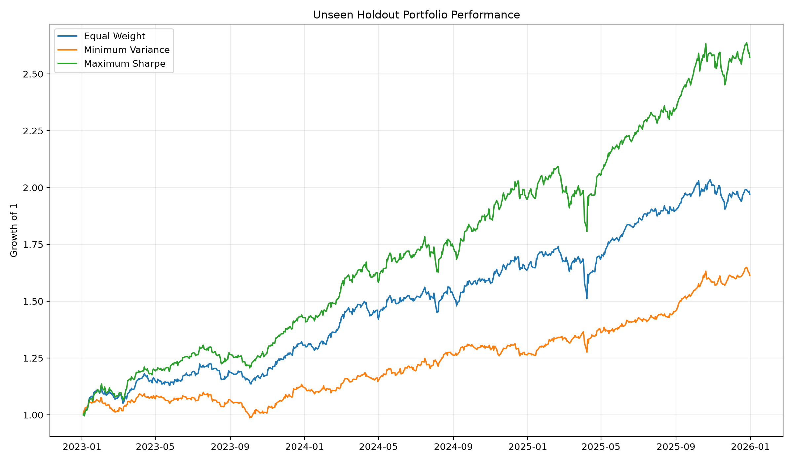
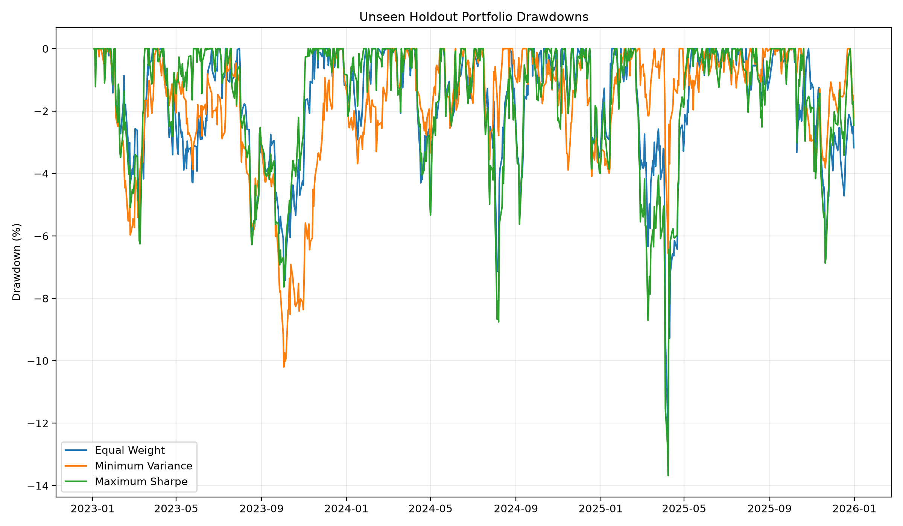

# Multi-Asset Risk & Portfolio Analytics Engine

An end-to-end quantitative finance project analysing portfolio performance,
market risk, diversification, stress scenarios and optimal asset allocation
across multiple asset classes.

The project combines Python, SQL, DuckDB, portfolio risk measurement,
historical stress testing, Monte Carlo simulation, regression analysis
and constrained portfolio optimisation.

---

## Project Objectives

The project investigates:

1. How risk and return differ across major asset classes.
2. How diversification changes portfolio volatility and drawdowns.
3. How Value-at-Risk and Expected Shortfall vary across methodologies.
4. How portfolios behave during historical market stress periods.
5. Which assets contribute most to total portfolio risk.
6. How constrained portfolio optimisation changes asset allocation and
   out-of-sample performance.

---

## Asset Universe

The analysis includes:

- US Equities — SPY
- US Technology — QQQ
- European Equities — VGK
- Emerging Markets — EEM
- US Treasuries — TLT
- Gold — GLD
- Oil — USO
- Bitcoin — BTC-USD

The common-date dataset contains 2,010 daily return observations from
2018 through 2025.

---

## Project Pipeline

Yahoo Finance  
↓  
Python data ingestion  
↓  
Daily return construction  
↓  
DuckDB / SQL analytics  
↓  
Risk and performance analysis  
↓  
Correlation and diversification analysis  
↓  
VaR and Expected Shortfall  
↓  
Monte Carlo simulation  
↓  
Historical stress testing  
↓  
CAPM-style regression  
↓  
Portfolio optimisation  
↓  
Risk-contribution analysis  
↓  
Out-of-sample portfolio backtest

---

## Technology Stack

- Python
- SQL
- DuckDB
- pandas
- NumPy
- SciPy
- statsmodels
- matplotlib
- yfinance
- Git / GitHub

---

## Asset Risk Findings

The analysis shows substantial differences in risk across asset classes.

- Bitcoin had the highest annualised volatility at approximately **64.65%**
- Gold had the strongest asset-level historical Sharpe ratio in the full sample
- Oil exhibited very large historical drawdowns
- US Treasuries and Gold provided relatively low correlation with equities

In the equal-weight portfolio, Bitcoin contributed approximately
**33.77% of total portfolio volatility risk** despite representing only
12.5% of portfolio capital.

---

## Historical Stress Testing

Two historical stress periods were evaluated.

### COVID-19 market crash

The equal-weight portfolio declined approximately **25.98%**.

Notable asset performance included:

- US Equities: -33.72%
- European Equities: -36.26%
- Oil: -56.35%
- US Treasuries: +14.23%

### 2022 inflation and interest-rate shock

The equal-weight portfolio declined approximately **23.78%**.

Notable asset performance included:

- US Technology: -34.77%
- US Treasuries: -30.59%
- Bitcoin: -58.70%
- Oil: +27.98%

These scenarios illustrate how diversification benefits vary across
different macro-financial stress regimes.

---

## Value-at-Risk and Expected Shortfall

For the equal-weight portfolio:

| Risk Measure | Daily Loss |
|---|---:|
| Historical VaR 95% | 1.495% |
| Historical ES 95% | 2.485% |
| Historical VaR 99% | 2.867% |
| Parametric Gaussian VaR 95% | 1.670% |
| Monte Carlo VaR 95% | 1.675% |
| Monte Carlo VaR 99% | 2.384% |

The historical tail measures are larger than the Gaussian and Monte Carlo
estimates in the extreme tail, highlighting the importance of non-normal
market behaviour.

---

## Portfolio Optimisation

Three strategies are compared:

- Equal Weight
- Minimum Variance
- Maximum Sharpe

Portfolio optimisation is:

- long only
- fully invested
- capped at **35% maximum weight per asset**

The 35% concentration constraint prevents the optimiser from allocating an
unrealistically large share of the portfolio to a single asset.

---

## Out-of-Sample Validation

Portfolio weights are estimated using:

**2018-2022 training data**

The weights are then locked and evaluated on:

**2023-2025 unseen holdout data**

This prevents the final portfolio evaluation from using the same sample
that was used to optimise the weights.

---

## Training-Sample Portfolio Weights

### Minimum Variance

The main allocations were approximately:

- US Treasuries: **35.00%**
- Gold: **35.00%**
- US Equities: **23.86%**
- Oil: 2.79%
- Emerging Markets: 2.51%
- European Equities: 0.84%

### Maximum Sharpe

The main allocations were approximately:

- US Technology: **35.00%**
- Gold: **35.00%**
- US Equities: **19.01%**
- Bitcoin: **10.99%**

---

## Unseen Holdout Results

| Portfolio | Annualised Return | Volatility | Sharpe | Max Drawdown | VaR 95% | ES 95% |
|---|---:|---:|---:|---:|---:|---:|
| Equal Weight | 25.52% | 12.79% | 1.685 | -13.17% | 1.12% | 1.68% |
| **Minimum Variance** | 17.38% | **10.05%** | 1.446 | **-10.20%** | **0.97%** | **1.32%** |
| Maximum Sharpe | **37.25%** | 14.28% | **2.150** | -13.68% | 1.32% | 1.90% |

---

## Key Out-of-Sample Findings

The Minimum-Variance portfolio delivered the strongest downside-risk
reduction on unseen data.

Compared with Equal Weight, it achieved:

- **21.44% lower realised annualised volatility**
- **22.54% lower maximum-drawdown magnitude**
- Lower historical 95% VaR
- Lower historical Expected Shortfall

The Maximum-Sharpe portfolio achieved the highest realised return and
Sharpe ratio, but also exhibited higher volatility and tail risk than the
Equal-Weight portfolio.

This highlights the fundamental trade-off between maximising
risk-adjusted return and minimising downside risk.

---

## Holdout Portfolio Performance

---

## Holdout Portfolio Drawdowns

---

## Important Interpretation

The project is a historical quantitative analytics exercise rather than
an investment recommendation.

Portfolio optimisation relies on historical estimates of expected returns
and covariance.

The analysis does not currently include:

- Transaction costs
- Taxes
- Bid-ask spreads
- Liquidity constraints
- Market impact
- Dynamic portfolio rebalancing

Bitcoin is aligned to the common weekday trading calendar of the other
assets for the multi-asset portfolio analysis.

---

## Repository Outputs

### Risk Analytics

- `reports/tables/asset_risk_summary.csv`
- `reports/tables/portfolio_var_es_summary.csv`
- `reports/tables/historical_stress_tests.csv`
- `reports/tables/asset_pricing_regression.csv`
- `reports/tables/portfolio_risk_contributions.csv`

### Portfolio Optimisation

- `reports/tables/optimised_portfolio_weights.csv`
- `reports/tables/portfolio_strategy_comparison.csv`
- `reports/tables/efficient_frontier_simulation.csv`

### Out-of-Sample Validation

- `reports/tables/holdout_portfolio_weights.csv`
- `reports/tables/portfolio_holdout_summary.csv`
- `reports/figures/portfolio_holdout_performance.png`
- `reports/figures/portfolio_holdout_drawdowns.png`

---

## Future Extensions

Potential extensions include:

- Rolling or expanding portfolio rebalancing
- Dynamic covariance estimation
- GARCH volatility forecasting
- Factor models
- Black-Litterman allocation
- Transaction-cost modelling
- Risk-parity portfolios
- Scenario-generation models

---

## Project Status

**Core analytical MVP completed.**

The project now includes data engineering, SQL analysis, risk measurement,
stress testing, portfolio optimisation, risk decomposition and a separate
out-of-sample portfolio evaluation.